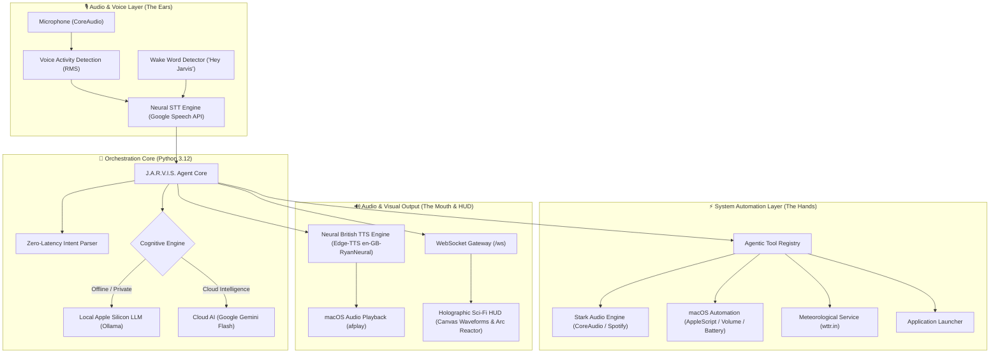

# J.A.R.V.I.S. — Just A Rather Very Intelligent System

<p align="center">
  
  
  
  
  
</p>

An autonomous, voice-controlled personal assistant designed natively for **macOS**, engineered after Tony Stark's iconic **J.A.R.V.I.S.** assistant from Iron Man.

Equipped with a **Dual-Engine cognitive core** (local on-device Ollama + cloud Gemini), **hands-free wake word detection**, **zero-latency macOS system automation**, an authentic **British neural voice**, and a **translucent sci-fi Arc Reactor holographic HUD** with live canvas waveforms and WebSockets.

---

## 🏛️ System Architecture



---

## ✨ Key Capabilities

### 1. 🎸 The "Tony Stark" Protocol
- Plays AC/DC's *"Highway to Hell"* on startup or via voice command (*"Jarvis, initiate Stark protocol"*).
- Dual-priority playback: plays local lossless audio directly through macOS CoreAudio (`afplay`) with zero ads and zero latency, with graceful fallback to Spotify.

### 2. 🧠 Dual-Engine Intelligence Core
- **Privacy Mode (100% Offline)**: Runs on-device on Apple Silicon using Ollama (`llama3.2`, `mistral`).
- **Cloud Mode**: Connects to Google Gemini Flash API for rapid, high-intelligence reasoning.
- **Smart Intent Parser**: Instant 0ms routing for system operations (volume, battery, apps, weather, music).

### 3. 🎙️ Full Hands-Free Voice Loop
- **Always-on background listener**: Triggers on *"Hey Jarvis"*, *"Jarvis"*, or *"Okay Jarvis"*.
- **Push-to-Talk Mode**: Press `Spacebar` on the HUD or `Enter` in the terminal to speak.
- **British Neural Voice**: Authentic cultured tone powered by `en-GB-RyanNeural`.

### 4. 🖥️ Holographic Sci-Fi HUD & Web Dashboard
- Multi-layer rotating **Arc Reactor** with energy pulse core.
- Real-time **Canvas Waveform Visualizer** reacting to speech.
- Live **2-second telemetry heartbeat**:
  - 🔋 Battery percentage & charging status
  - 🔊 Master CoreAudio volume slider
  - ☁️ Live atmospheric weather & temperature
  - 🎵 Real-time media track banner synchronized with Spotify
  - 💬 Live tactical transcript feed

---

## 📂 Project Structure

```
JARVIS/
├── config.py                 # Central configuration (Identity, Audio, AI providers)
├── main.py                   # Master CLI entry point (HUD, voice, diagnostics, console)
├── server.py                 # FastAPI & WebSocket server launcher (http://127.0.0.1:8000)
├── requirements.txt          # Python dependencies
├── .gitignore                # Production ignore rules (secrets, venvs, audio assets)
├── assets/
│   ├── sounds/               # Local sound assets (intro.mp3 / Highway to Hell)
│   └── cache/                # MD5-cached neural TTS audio files
└── core/
    ├── brain/
    │   ├── agent.py          # Central agent orchestrator & conversation memory
    │   ├── intents.py        # Zero-latency regex & intent pattern engine
    │   ├── llm.py            # Dual-engine unified client (Ollama + Gemini)
    │   └── tools.py          # Tool registry & function calling schemas
    ├── system/
    │   ├── audio_player.py   # Hybrid local CoreAudio + Spotify playback engine
    │   ├── macos.py          # Native AppleScript bridge (Battery, volume, apps)
    │   ├── spotify.py        # Spotify player integration & URI normalizer
    │   └── weather.py        # Zero-key live weather scraper (wttr.in)
    ├── voice/
    │   ├── boot.py           # Tony Stark audio boot sequence & diagnostic report
    │   ├── listener.py       # Wake word background listener & push-to-talk
    │   ├── stt.py            # SoundDevice RMS microphone capture & neural STT
    │   └── tts.py            # Edge Neural TTS synthesis & CoreAudio player
    ├── server/
    │   ├── app.py            # FastAPI REST endpoints & WebSocket gateway
    │   └── static/
    │       ├── index.html    # Sci-Fi semantic HUD markup
    │       ├── style.css     # Cybernetic glassmorphism theme & animations
    │       └── app.js        # WebSockets, Canvas waveform visualizer, event handlers
    └── utils/
        └── logger.py         # Rich sci-fi terminal logger & ASCII telemetry
```

---

## 🚀 Quickstart & Installation

### 1. Clone & Set Up Environment

```bash
git clone https://github.com/ITSDeniz/J.A.R.V.I.S.---AI-Personal-Assistant.git
cd J.A.R.V.I.S.---AI-Personal-Assistant

# Create virtual environment with Python 3.12
python3 -m venv .venv
source .venv/bin/activate

# Install dependencies
pip install -r requirements.txt
```

### 2. Run Modes

#### 🖥️ Launch Holographic Web HUD (Recommended)
```bash
python main.py --hud
```
*Opens `http://127.0.0.1:8000` automatically in your browser with the live Arc Reactor dashboard.*

#### 🎙️ Hands-Free Background Wake Word ("Hey Jarvis")
```bash
python main.py --listen
```

#### 🎤 Push-to-Talk Voice Terminal
```bash
python main.py --voice
```

#### ⚡ Tony Stark Boot Sequence (Greeting + Highway to Hell)
```bash
python main.py --boot --music
```

#### 💬 Interactive Terminal Console
```bash
python main.py
```

---

## 💡 Portfolio Engineering Highlights

- **Zero API Costs**: Runs 100% free with open-source tools (Edge-TTS, sounddevice, wttr.in, Ollama).
- **Sub-Second Latency**: Built with asynchronous I/O, WebSockets, and cached TTS synthesis for fluid, instant interaction.
- **Privacy-First Architecture**: Audio never leaves the machine unless using cloud LLMs; all secrets, virtual environments, and downloaded audio assets are protected by `.gitignore`.
- **Native OS Automation**: Direct AppleScript integration with macOS CoreAudio and application processes.

---

## 📄 License
MIT License. Created by [ITSDeniz](https://github.com/ITSDeniz).
